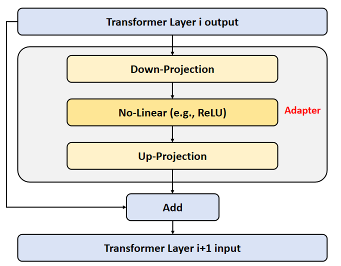

# Adapter微调+Lora微调

注意，需要先把你的数据转换成COCO形式，已在下面说明
## Adapter具体结构
Adapter 通常采用一种瓶颈（Bottleneck）结构，其目的是最大程度地减少新增参数量。在本代码中，如下图所示，Adapter 模块插入在 Transformer 层的子层之间。



数据在流经 Adapter 时，会依次经历以下过程：残差连接分支：输入信号 $x$ 直接被传递到 Adapter 的输出端，构成残差连接（Residual Connection），这保证了在初始状态下 Adapter 对原模型的性能无任何负面影响。下采样投影（Down-Projection）：输入信号 $x$ 首先通过一个线性层，将其维度从原始维度 $d$（input_dim）投影到一个较小的维度 $r$（bottleneck_dim）。非线性激活：投影后的特征通过一个非线性激活函数（如 ReLU, GeLU）进行处理，增强模块的表达能力。上采样投影（Up-Projection）：处理后的特征再通过另一个线性层，将其维度重新投影回 $d$，以适配原模型的后续计算。融合与输出：最后，上采样投影的输出与初始的残差信号进行相加操作，得到该 Adapter 层的最终输出 $x_{out}$。

在数学上，Adapter 的前向计算过程可以表示为：$$x_{out} = \text{ReLU}(x \cdot W_{down}) \cdot W_{up} + x$$其中，$W_{down} \in \mathbb{R}^{d \times r}$ 和 $W_{up} \in \mathbb{R}^{r \times d}$ 是 Adapter 中唯一需要训练的参数矩阵，而 Transformer 的原参数在训练过程中保持冻结（Frozen）。

它主要插入在SAM3的vision encoder, transformer encoder和transformer decoder中每一层transformer layer之间。

可训练参数占比：Trainable params: 19,514,113 (2.28%)

### Adapter添加的代码位置
sam3/model/decoder.py, sam3/model/encoder.py, sam3/model/vitdet.py

## LoRA微调

LoRA（Low-Rank Adaptation）是一种高效参数微调（Parameter-Efficient Fine-Tuning, PEFT）方法，其核心思想是在不修改原始预训练模型参数的情况下，通过引入低秩矩阵来学习任务相关的参数更新，从而显著减少训练参数量与显存开销。LoRA 最早被提出用于大语言模型微调，但目前已经广泛应用于视觉 Transformer、扩散模型以及多模态模型等领域。

对于 Transformer 中的线性层，其原始权重矩阵记为：

$$
W \in \mathbb{R}^{d \times k}
$$

传统微调会直接更新整个权重矩阵 $W$，而 LoRA 则假设权重更新矩阵 $\Delta W$ 具有低秩特性，因此将其分解为两个较小矩阵的乘积：

$$
\Delta W = BA,\quad B \in \mathbb{R}^{d \times r},\ A \in \mathbb{R}^{r \times k},\ r \ll \min(d,k)
$$

其中，$r$ 表示低秩维度（rank），通常远小于原始特征维度，因此新增参数量非常小。最终，线性层的输出可表示为：

$$
y = Wx + \Delta Wx = Wx + BAx
$$

在训练过程中，原始预训练权重 $W$ 保持冻结（Frozen），仅训练低秩矩阵 $A$ 与 $B$。由于新增参数量远小于完整模型参数，因此 LoRA 具有以下优点：

- 显著降低可训练参数量；
- 降低显存占用与训练成本；
- 保留原始预训练模型能力；
- 易于迁移到不同任务；
- 支持快速加载和切换不同任务权重。

在本项目中，LoRA 主要应用于 SAM3 的 Transformer 相关模块，通过对注意力层中的线性映射进行低秩分解，实现对模型的轻量化微调。相比于全参数微调，LoRA 能够在保持分割性能的同时，大幅减少训练资源消耗。

LoRA 主要插入在注意力模块（Attention）的 Query、Key、Value 或 Output Projection 等线性层中，仅对新增的低秩矩阵参数进行训练，而原始模型参数保持冻结。

### LoRA添加的代码位置

位置在：

```python
train_sam3_lora_iou_dice.py 第876行
```

## 运行
注意修改config中的数据和sam3权重地址。

### 环境安装
```shell
pip install datasets pillow numpy tqdm pycocotools
pip install -r requirements.txt
# 设置huggingface权重和数据据下载位置
export HF_HOME=/data/weights/huggingface
```

### 数据据准备
```shell
# 默认使用fold-1
python construct_coco_format.py \
  --output-dir /data/Data/ft_sam3/coco_vegann \
  --fold 1 \
  --include-test
```

### 训练：
分辨率修改：configs/full_lora_config.yaml里面最下面有一个image_size，修改那个就行

```shell
CUDA_VISIBLE_DEVICES=1 python3 train_sam3_lora_iou_dice.py --config configs/full_lora_config.yaml

CUDA_VISIBLE_DEVICES=1 python3 train_sam3_adapter_iou_dice.py --config configs/adapter_config.yaml
```

验证：
```shell
# 原始权重+iou, dice指标
python validate_sam3_lora_iou_dice.py \
  --use-base-model \
  --config configs/full_lora_config.yaml \
  --val_data_dir /data/Data/ft_sam3/coco_vegann/valid \
  --save-predictions \
  --prediction-output-dir /data/Data/ft_sam3/pred_vis

# lora微调+iou, dice指标
python validate_sam3_lora_iou_dice.py \
  --config configs/full_lora_config.yaml \
  --weights /data/weights/ft_sam3/outputs/sam3_lora_full/best_lora_weights.pt \
  --val_data_dir /data/Data/ft_sam3/coco_vegann/valid \
  --save-predictions \
  --prediction-output-dir /data/Data/ft_sam3/pred_vis
```

## 实验结果
原始sam3在验证集的结果：
```text
Mean IoU: 0.7384
Mean Dice: 0.8122
```

LoRA微调后在验证集的结果：
```text
Mean IoU: 0.8650
Mean Dice: 0.9217
```

Adapter微调后结果：
```text
Mean Iou: 0.8602
Mean Dice: 0.9172
```

## Note
加载权重如果出现freqs_cis 缺失，这个是正常的，这个权重不是一个可学习的权重，它的位置在：FT_SAM3/sam3/model/vitdet.py的393行里面定义